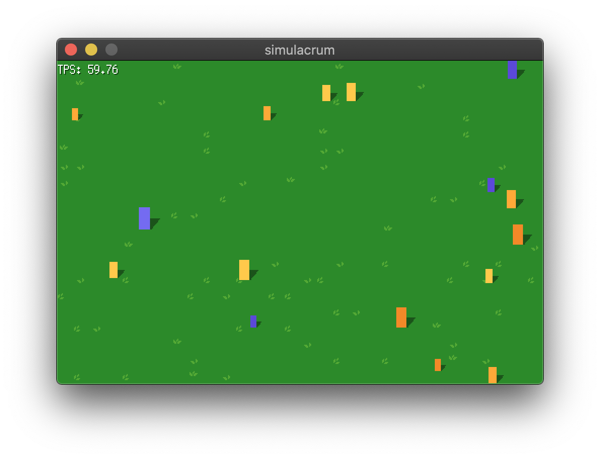

# simulacrum

_The world, or something sorta like it._

<p align="center">
  
</p>

## Usage

With [`Go`](https://golang.org) installed:

```bash
# Install from source:
go get go.stevenxie.me/simulacrum

# Run:
simulacrum     # on unix
simulacrum.exe # on windows
```
